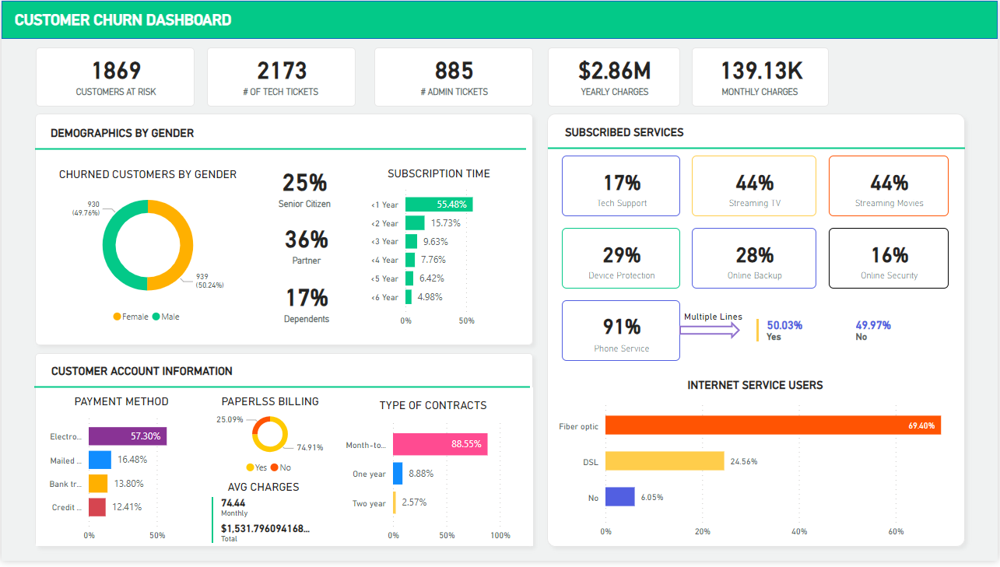

#Customer Churn Analysis in Power BI
This project uses Power BI Desktop and Excel to help businesses prevent customer loss and improve customer service.
Key Features:
📌 Predictive Churn Modeling: Identify at-risk customers before they churn, enabling proactive interventions and retention strategies.

📌 Customer Segmentation: Group customers based on shared characteristics and churn risk, allowing for targeted marketing and engagement efforts.

